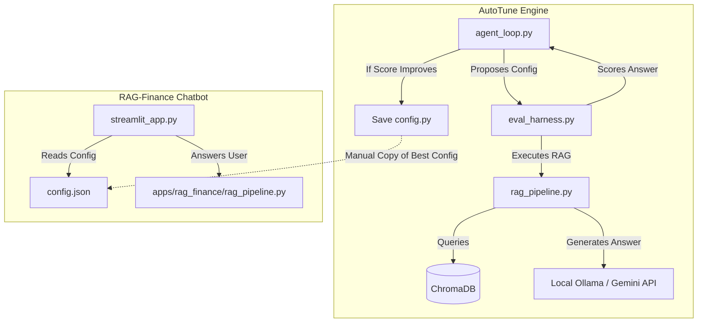

# 🚀 AutoTune: A Self-Improving Hyperparameter Optimizer for RAG Pipelines

> **AutoTune** is an automated optimization loop—inspired by Andrej Karpathy's `autoresearch`—that autonomously tunes a RAG pipeline's hyperparameters by formulating hypotheses, executing experiment runs against a benchmark evaluation set, and persistently keeping only the changes that mathematically improve the accuracy score. 
>
> To demonstrate its efficacy in a real-world scenario, this repository contains **RAG-Finance**, a production-style question-answering system over Indian tax slabs, GST council circulars, RBI monetary policy reports, and the Union Budget 2024.

---

## 📊 Before vs. After Optimization Results

| Parameter | Default Config (Suboptimal) | Tuned Config (AutoTune Optimized) |
| :--- | :---: | :---: |
| **Chunk Size** | 200 characters | **500 characters** |
| **Chunk Overlap** | 20 characters | **50 characters** |
| **Top-K Retrieval** | 2 chunks | **3 chunks** |
| **Temperature** | 0.0 | **0.0** |
| **Benchmark Accuracy** | **50.0%** (7/14 answered) | **100.0%** (14/14 answered) 🎉 |

### Why Default Settings Fail:
Under default settings (`chunk_size=200`, `top_k=2`), asking the chatbot *"What are the GST tax slabs in India?"* resulted in:
> *"I don't have enough information to answer this question."*
This happened because the relevant tax slabs were split across tiny chunks, and the retrieval limit was too shallow to assemble the complete picture for the LLM.

### How AutoTune Fixed It:
The AutoTune agent proposed increasing the `chunk_size` to `500` and `top_k` to `3`. During the next experiment, the retriever pulled larger, cohesive text segments, successfully capturing the entire GST rates table. The evaluation score for that question rose from `0.0` to `1.0`, and the agent automatically promoted this configuration to production.

---

## 🏛️ Monorepo Architecture

This project is structured as a monorepo separating the general-purpose optimization engine from the target consumer application:

```
autotune/
├── engine/              # The core optimization engine
│   ├── agent_loop.py    # experiments orchestrator (propose-eval-decide)
│   ├── eval_harness.py  # runs the test suite and scores configurations
│   ├── rag_pipeline.py  # RAG functions used by the engine to test
│   ├── config.py        # active configuration values (updated dynamically)
│   ├── program.md       # prompt persona guiding the tuning agent
│   └── main.py          # FastAPI server with WebSocket status streaming
├── apps/
│   └── rag_finance/      # The target production application
│       ├── streamlit_app.py  # User-facing chatbot interface
│       ├── rag_pipeline.py  # Config-driven RAG logic
│       ├── config.json      # Production configuration parameters
│       ├── documents/        # PDF text extracts (tax, GST, RBI corpus)
│       └── benchmark.py     # Independent script to run before-vs-after comparison
├── dashboard/            # React status dashboard (serves on http://localhost:8000)
└── README.md
```



---

## 🔄 The Self-Improving Optimization Loop

1. **Observe State**: The agent is shown the current hyperparameters and the complete history of previous experiments.
2. **Propose Hypothesis**: The LLM analyzes the score trajectory and writes a reasoning statement (e.g., *"Reducing top_k to 1 caused a score drop, but increasing chunk size to 500 improved the standard deduction question. I will keep chunk size at 500 and try top_k=3 to balance context depth and noise."*).
3. **Execute Experiment**: The engine updates the temporary configuration, cleans the vector index, rebuilds it using the new chunk settings, and runs the evaluation benchmark.
4. **Compare & Decide**: If the new aggregate score is higher than the historical best, the config is **Accepted** and saved to disk. Otherwise, it is **Rejected** and reverted.

---

## 🛠️ Tech Stack

* **Backend Engine**: Python 3.10+, FastAPI, WebSockets
* **Frontend Dashboard**: React, Vite, Tailwind CSS, Lucide icons
* **Vector Search**: ChromaDB (Persistent local instance)
* **Embedding Model**: `sentence-transformers/all-MiniLM-L6-v2` (Running locally)
* **LLM Engine**: Local Ollama (`qwen2.5:1.5b` or `llama3.2`) with failover support to Google Gemini API
* **App GUI**: Streamlit

---

## 🧠 Design Decisions & Engineering Tradeoffs

### 1. Dual LLM Backend (Ollama + Gemini API)
To allow developers to build and test locally with **zero API costs**, the system defaults to local Ollama inference. If running in a production or cloud environment, the backend automatically detects a `GEMINI_API_KEY` and routes requests to Gemini for higher throughput.

### 2. Configuration-Diff Logs vs. Git Versioning
Instead of polluting the Git commit history with automatic commits for every rejected or temporary configuration experiment, AutoTune logs experiment histories in a local SQLite database (`autotune.db`) and commits only the final accepted best configuration back to the Python module (`config.py`).

### 3. Substring keyword evaluation
To avoid expensive LLM-as-a-judge evaluations during rapid iterations, the benchmark score is calculated by verifying whether the generated response contains expected target terms (e.g. `["1.5 lakh"]` for Section 80C limit). This is fast, deterministic, and can run completely on CPU.

---

## 🚀 Local Setup & Running

### 1. Clone & Set Up Virtual Environment
```powershell
git clone https://github.com/R1shabhCodes/AutoTune.git
cd AutoTune

# Set up virtual environment
python -m venv .venv
.venv\Scripts\activate
pip install -r apps/rag_finance/requirements.txt
```

### 2. Run the AutoTune Optimizer
Make sure **Ollama** is open and running, then pull the model:
```powershell
ollama pull qwen2.5:1.5b
```

Launch the FastAPI backend server:
```powershell
.venv\Scripts\uvicorn engine.main:app --host 127.0.0.1 --port 8000
```
Open `http://127.0.0.1:8000/` to watch the experiment loop run live.

### 3. Run the Production Chatbot
In a new terminal window:
```powershell
cd apps/rag_finance
..\..\.venv\Scripts\streamlit run streamlit_app.py
```
Open the Streamlit URL to test your optimized financial assistant!
